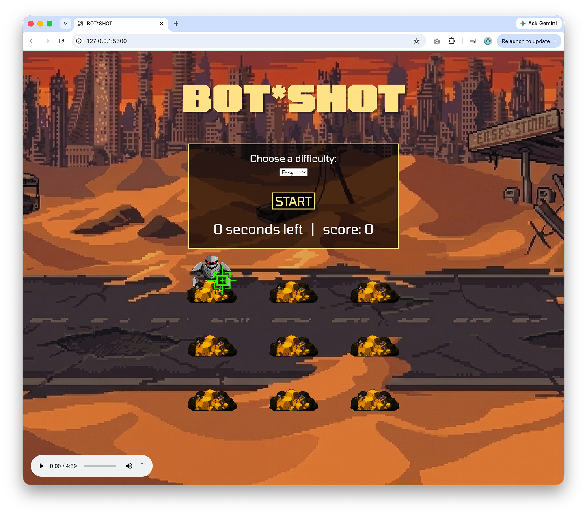
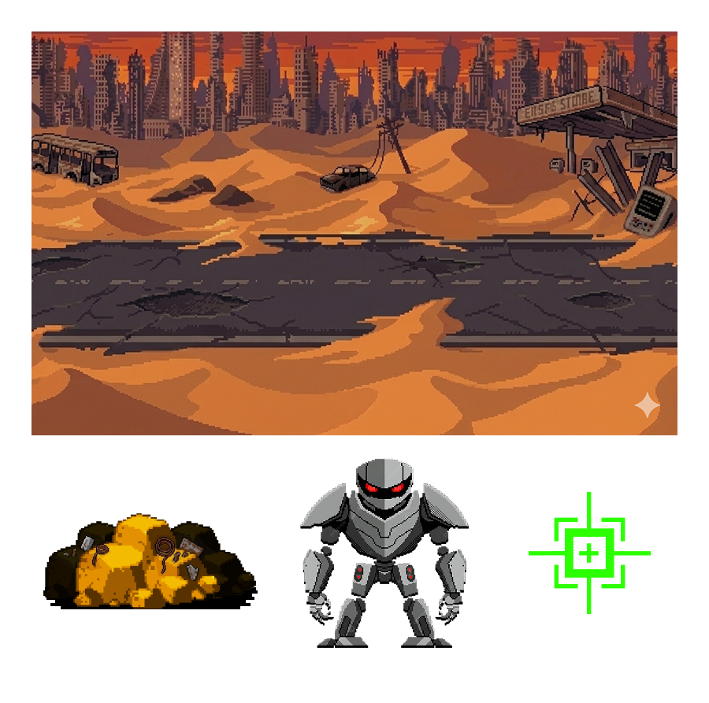
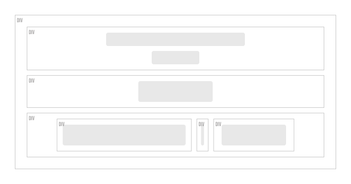

# BOT*SHOT
A local game development studio has decided to create a new pc game that's similar to Whack-A-Mole called **BOT*SHOT**. This game takes place in the wastelands of a post-apocalyptic future where killer robots rove the outskirts of a ruined city they destroyed in years long passed. The object of the game is to shot as many as possible within the time limit as the pop in and out of vision from the rubble.

*This is a browser based game developed with JavaScript, HTML, and CSS.*

## Project Plan

### 1. Basic (Missing) Feature Requirements
*Provide missing code to complete the following feautures.*

| Feature | Action Plan |
| :--- | :--- |
| Game title | Use `h1` tag with `title` set as `id` |
| Game play grid | Nine `div` elements |
| Start Button | Define in HTML |
| Difficulty Settings | Use `setDelay()` to set behavior for each difficulty |
| Hard Difficulty | Use `randomInteger()` to set random timing for `Hard` difficulty |
| Moles | Use `classlist.add()` and `classlist.remove()` to show and hide "moles" |
|| Use `randomInteger()` to random select which mole is shown |
|| `.addEventListener` on "moles" for to allow for score tracking |
| Game Over | Provide JS function to stop game when `timer` reaches 0 |  
| Game Start | Provide JS function to start game when `start` button is clicked |
| Score | Use `document.querySelector` and `.textContent` to update score on "mole" click event |
| Clear score | Use `document.querySelector` and `.textContent` to set score to zero on game restart |
| Timer | Query selector needed in JS |
|| Use `setInterval()` and `.textContent` to start and update timer |

### 2. Functional Enchancements 

*Additions to the functionality beyond the intial feature requirements.* 

| Feature | Action Plan |
| :--- | :--- |
| Difficulty selector | Add a `select` element and `.addEventListener` to control game difficulty | 
| Button toggle | Add `stop` button state and create JS functions to switch between `start` and `stop` states |
| Stop button | Update `stopGame()` so the `stop` button stops the game when clicked |
| Laptop breakpoint | Use `@media` query resize the `gird` and `h1` for smaller viewport size |

### 3. Theme Overhaul

*Retheme the existing **Whack-a-Mole!** styling with the new **`BOT*SHOT`** styling.*

| Colors |
| :--- |
| `#000000` |
| `#ffffff` |
| `#ffe591` |

| Font |
| :--- |
| `Tomorrow` (Google Font) |

| Audio file | Function |
| :--- | :--- |
| shot.mp3 | Sound effect for succesful `click` on robot set with `play()` |
| 05-reactor.mp3 | Optional background music set with `audio` tag and  `controls` attribute |

**Images:**

**Scoreboard:**

*Add a `scoreboard` container to house controls, timer, and score for the game.*

## Implementation Plan
1. Fork and clone the existing **Whack-a-Mole** repository to local machine and install the approprite packages.
2. Reference User Stories in README file and use VSCode to enhance code beginning with HTML structure.
3. Move on to address implement functionality with Javascript.
4. Implement new theme using CSS. Create new image assets using Nano Banano, Figma, and Affinty Photo. Import new font from Google fonts. 
5. Implement addtional enhancements once User Stories have been completed.
6. Add audio and functions.
7. Test the game with Jest.

## Decisions, Trade-offs, & Challenges

### 1. Scoreboard Container
The background image for the new theme is a lot busier than the original **Whack-a-Mole** image. Due to this, I placed the game controls, timer, and score, within a `div` and gave it a mostly opaque background to ensure legibility of the text. I also added a border for visual appeal.

### 2. Difficulty Selector
The original repo did not provide a way to control the difficulty of the game within the browser. To achieve this I included a `select` element and needed to look up how to listen for the `change` event of the dropdown menu the difficulty change to take affect. At fist I place this new listener in the `setEventListeners()` function with the `mole` event listener. However, this did not work because that listener is not evoked until the game begins. The difficulty must start before that. So I needed to create that event listener separately.   

### Button toggle 
While testing the game, I decided that I wanted the ability to stop the game before the play time elapsed. To do this, I decided make the `start` button to a toggle button. Using GitHub Copilot that I have on installed another machine I vibe-coded a simple example prototype and analyzed the code. After doing this I and implemented the code into this project. However it required me to completelty refactor the `stopGame()` and upadte the `startGame` function to get it to work.

### Audio control
I did not want to include auto-playing background audio in the game as many gamers these days listen to there own music whilst gaming. Instead I include an `audio controls` element that is fixed to the lower left corner of the viewport.

### Laptop Breakpoint
While testing the game on my laptop I noticed that the bottom three `holes` of the grid were invisible. I set a breakpoint at a height of `895px` to shrink the title and the grid so that game can be playable on smaller screens. Due to time restrains, I was unable to make it adaptive for mobile.

## AI Tools Disclosure
| AI Tool | Utility |
| :--- | :--- |
| Google Gemini | Used for brainstorming and trouble-shooting |
| GitHub Copilot | Used for brainstorming |
| CodeGPT | Used for inline code suggestions and autocomplete |
| Nano Banana | Used for image generation |  

## Project Process Summary
The development of **BOT*SHOT** involves converting a standard browser-based Whack-A-Mole clone into a post-apocalyptic themed game using HTML, CSS, and JavaScript. The process requires implementing core features, enhancing functionality with a start/stop toggle, applying a thematic overhaul, and using AI tools to navigate technical challenges such as layout adjustments for smaller screens and scoreboard readability. The implementation plan focuses on repository management, code enhancement, styling, and testing to produce the final interactive experience.

## Commit History

## VSCode Screenshots (Did not use Replit)

